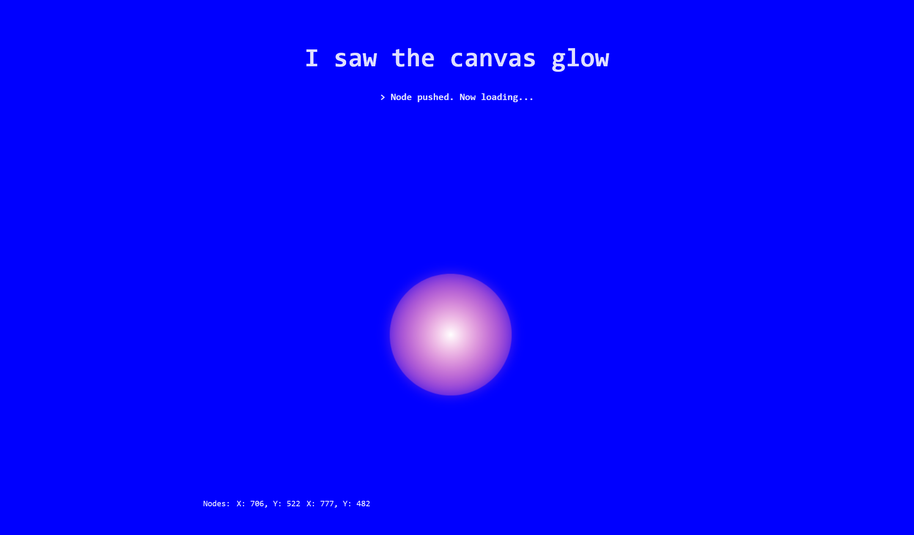

# Canvas Glow ASR

A React frontend for speech-to-text transcription with an interactive visual interface.



## Features

- **Interactive Canvas** - Click the glowing sphere to record, visual feedback shows state
- **Multiple Capture Methods** - AudioWorklet (low latency) or MediaRecorder (WAV encoding)
- **Realtime Streaming** - Send audio chunks at intervals for live transcription
- **Voice Activity Detection** - Silero VAD detects speech and transcribes automatically
- **Audio Controls** - Input gain, echo cancellation, auto gain, noise suppression
- **Debug Tools** - Download raw/processed audio, view stats in console

## Quick Start

```bash
# Install dependencies
bun install

# Start development server
bun run dev

# Build for production
bun run build
```

## Requirements

- A running ASR server (default: `http://localhost:8080`)
  - `GET /health` - Health check endpoint
  - `POST /inference` - Transcription endpoint (multipart form with WAV file)

## Usage

1. Open the app in your browser
2. Click **+ Settings** to configure:
   - **Server URL** - Your ASR backend address
   - **Language** - Target language for transcription
   - **System Prompt** - Spelling hints (e.g., "Preserve spelling: JFK, NASA")
   - **Audio Settings** - Capture method, gain, processing options
3. Click the sphere to start recording (turns pink)
4. Speak into your microphone
5. Click again to stop and transcribe

### Recording Modes

| Mode | Description |
|------|-------------|
| **Single** | Record full audio, transcribe on stop |
| **Realtime** | Stream chunks every N seconds |
| **Realtime + VAD** | Auto-detect speech, transcribe segments |

### Visual Feedback

| Color | State |
|-------|-------|
| Grey | Idle |
| Pink (pulsing) | Recording |
| Cyan | VAD detected speech |
| Purple | Processing/transcribing |

## System Prompt

The system prompt guides ASR transcription with spelling hints and context:

```
Preserve spelling: JFK, NASA, OpenAI
```

- Syncs to server automatically when you finish editing (on blur)
- Useful for proper nouns, acronyms, and technical terms
- Server injects prompt tokens into decoder sequence

## Audio Settings

### Capture Method

- **AudioWorklet** (default) - Modern API, runs on audio thread, lowest latency
- **MediaRecorder** - Uses browser's MediaRecorder with WAV encoding

### Browser Audio Processing

- **Echo Cancel** - Removes echo and feedback
- **Auto Gain** - Automatic volume leveling
- **Noise Suppress** - Reduces background noise

### Input Gain

Adjust microphone input level (10% - 100%). Useful for:
- Reducing clipping on loud microphones
- Boosting quiet microphones

## Debug Features

After recording, the Audio Settings panel shows:
- **Audio preview players** - Listen to raw and processed audio
- **Download buttons** - Save WAV files for analysis
- **Console stats** - Duration, sample count, peak, RMS levels

## Tech Stack

- React 19 + TypeScript
- Vite
- Zustand + Immer (state management)
- Web Audio API (AudioWorklet, GainNode, OfflineAudioContext)
- extendable-media-recorder (WAV MediaRecorder support)
- @ricky0123/vad-react (Silero VAD)

## License

MIT
